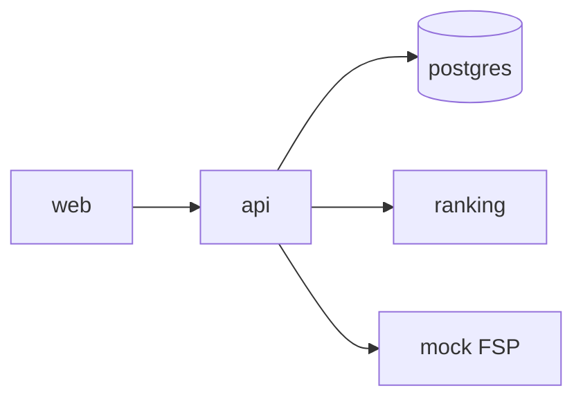

# Как работает

Как устроен сервис: кабинет, API, подборка, тесты, приглашения.

Сюда — общая схема (SVG из `public/diagrams/`) и mermaid по потокам.

```mermaid
flowchart LR
  web[web] --> api[api]
  api --> pg[(postgres)]
  api --> ranking[ranking]
  api --> mock[mock FSP]
```
